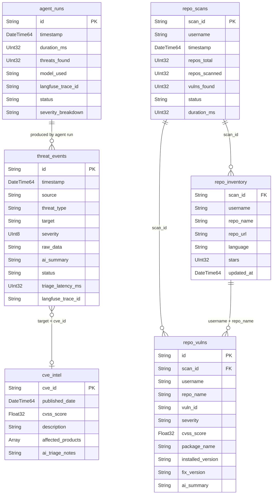
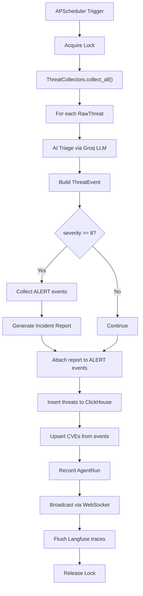
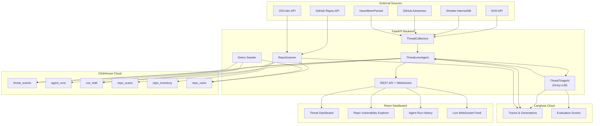

# ThreatLens Architecture

## Overview

ThreatLens is an autonomous cyber-threat intelligence platform that collects threat signals from multiple sources, triages them with an LLM, stores structured results in ClickHouse, and presents a real-time dashboard via React.

---

## Data Flow

```
GitHub Repos → Dependency Parsing → OSV Vulnerability Lookup → ClickHouse Storage → React Dashboard
     │                                                                │
     │         NVD / Shodan / GitHub Advisories / HIBP                │
     │                    ↓                                           │
     │            ThreatCollectors                                    │
     │                    ↓                                           │
     │          Groq LLM Triage (AI)                                  │
     │                    ↓                                           │
     └──────────────→ ClickHouse ←────────────────────────────────────┘
                          ↓
                   FastAPI REST + WebSocket
                          ↓
                    React Frontend
```

1. **Collection** — `collectors.py` pulls threat intelligence from NVD (CVEs), Shodan (exposed services), GitHub Security Advisories, and HaveIBeenPwned (breaches). Falls back to realistic demo data when API keys are absent.

2. **Repo Scanning** — `repo_scanner.py` fetches a GitHub user's repositories, parses dependency files (package.json, requirements.txt, go.mod, etc.), queries the OSV API for known vulnerabilities, and stores results in ClickHouse.

3. **AI Triage** — `ai.py` sends each raw threat to the Groq API (Llama 3.3 70B) using structured tool calling. The LLM returns a severity score (1–10), threat type classification, executive summary, and an IGNORE / MONITOR / ALERT decision. Includes retry logic with exponential backoff for transient errors.

4. **Storage** — `database.py` manages a ClickHouse Cloud instance with columnar tables optimized for analytical queries (severity histograms, source rollups, latency percentiles).

5. **Presentation** — FastAPI serves REST endpoints and WebSocket feeds. The React frontend consumes these for the threat dashboard, repo vulnerability explorer, and agent run history.

---

## ClickHouse Table Relationships



### Table Details

| Table | Engine | Partition | Order | Purpose |
|-------|--------|-----------|-------|---------|
| `threat_events` | MergeTree | `toYYYYMM(timestamp)` | `(timestamp, severity, source, id)` | All triaged threat intelligence events |
| `agent_runs` | MergeTree | `toYYYYMM(timestamp)` | `(timestamp, id)` | Agent execution history and metrics |
| `cve_intel` | ReplacingMergeTree | `toYYYYMM(published_date)` | `cve_id` | Deduplicated CVE intelligence |
| `repo_scans` | MergeTree | `toYYYYMM(timestamp)` | `(username, scan_id, timestamp)` | GitHub repo scan runs |
| `repo_inventory` | ReplacingMergeTree | — | `(username, repo_name)` | Scanned repository metadata |
| `repo_vulns` | MergeTree | `toYYYYMM(published_date)` | `(username, repo_name, severity, vuln_id)` | Per-package vulnerability findings |

---

## Langfuse Tracing Points

ThreatLens instruments the following operations with Langfuse traces:

| Trace Name | Module | What It Captures |
|------------|--------|-----------------|
| `threat-triage` | `ai.py` | Each LLM triage call — prompt, tool output, severity score, decision, token usage, latency |
| `incident-report` | `ai.py` | Incident report generation for ALERT-level clusters |
| `agent-run` | `agent.py` | Full agent execution — threats collected, triaged, stored; alert count scores |
| `repo-scan` | `repo_scanner.py` | Repository scan lifecycle — repos fetched, deps parsed, OSV queries, vuln counts |
| `osv-package-query` | `repo_scanner.py` | Individual OSV API calls per package — latency, vuln count, errors |

**Scores recorded:**
- `severity_score` — Normalized severity (0–1) per triage
- `alert_decision` — Binary (1 = ALERT, 0 = other) per triage
- `threats_found` — Count of threats per agent run
- `alert_count` — ALERT-level threats per agent run
- `vuln_count` — Repository vulnerabilities per scan
- `critical_count` — Critical vulnerabilities per scan

---

## Agent Pipeline

The autonomous agent (`agent.py`) runs on a configurable interval (default: 5 minutes) via APScheduler:



### Agent Steps

1. **Lock** — Prevents concurrent runs via `asyncio.Lock`
2. **Collect** — Gathers raw threat intel from all 4 sources (NVD, Shodan, GitHub, HIBP)
3. **Triage** — Each threat is scored and classified by the Groq LLM with retry logic
4. **Incident Report** — If any ALERT-level threats exist, generates an executive incident report
5. **Store** — Inserts triaged events and extracted CVEs into ClickHouse
6. **Broadcast** — Pushes new events to connected WebSocket clients in real time
7. **Observe** — Flushes all traces and scores to Langfuse for monitoring

---

## System Architecture Diagram



---

## Key Design Decisions

- **ClickHouse Cloud** for sub-second analytical queries over columnar threat data, with MergeTree partitioning by month
- **Groq API** with Llama 3.3 70B for fast, structured LLM triage via tool calling
- **Langfuse** for full observability of LLM calls — cost tracking, latency monitoring, quality scoring
- **WebSocket broadcast** for real-time threat feed without polling
- **Deterministic fallback triage** when Groq API is unavailable, ensuring the pipeline never blocks
- **OSV.dev** for dependency vulnerability scanning — free, comprehensive, ecosystem-aware
