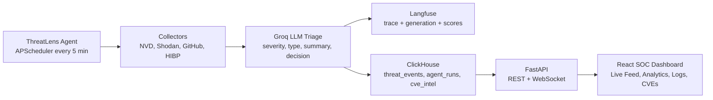

# ThreatLens


ThreatLens is a full-stack AI cybersecurity threat intelligence platform. It collects attack-surface signals, triages them with Groq `llama-3.3-70b-versatile`, traces every inference in Langfuse, stores events in ClickHouse, and streams a live dark SOC dashboard.

## Architecture



## Setup In 3 Commands

```bash
git clone https://github.com/your-org/threatlens.git
cd threatlens && cp .env.example .env
docker compose up --build
```

The Compose file includes working defaults for Langfuse and ClickHouse. Add `GROQ_API_KEY` to `.env` to enable live Groq inference. Without it, ThreatLens automatically uses deterministic local triage so the dashboard and pipeline still work.

Dashboard: [http://localhost:5173](http://localhost:5173)  
API: [http://localhost:8000](http://localhost:8000)

## What It Does

- Collects recent CVEs from NVD, GitHub security advisories, Shodan InternetDB exposure data, and HIBP domain breaches.
- Scores each threat from 1-10, classifies type, writes a two-sentence executive summary, and decides `IGNORE`, `MONITOR`, or `ALERT`.
- Writes all threat events, CVE intelligence, and agent runs to ClickHouse.
- Traces every Groq call in Langfuse with model, usage, latency, severity score, decision, source, threat type, and severity bucket.
- Runs automatically every 5 minutes and immediately on startup.
- Auto-seeds 300 realistic events if the database has fewer than 50 rows.

## Demo Queries

Threat volume and severity by hour:

```sql
SELECT
  toStartOfHour(timestamp) AS hour,
  count() AS threats,
  round(avg(severity), 2) AS avg_severity
FROM threat_events
WHERE timestamp >= now() - INTERVAL 24 HOUR
GROUP BY hour
ORDER BY hour DESC
LIMIT 5;
```

Expected output:

```text
hour                 threats  avg_severity
2026-06-12 18:00:00  12       6.83
2026-06-12 17:00:00  9        5.78
2026-06-12 16:00:00  14       7.21
```

p95 AI triage latency by source:

```sql
SELECT
  source,
  count() AS events,
  quantile(0.95)(triage_latency_ms) AS p95_triage_ms
FROM threat_events
WHERE triage_latency_ms > 0
GROUP BY source
ORDER BY events DESC;
```

Expected output:

```text
source   events  p95_triage_ms
nvd      96      1710
shodan   84      1664
github   72      1592
hibp     48      1518
```

Critical targets for incident response:

```sql
SELECT
  target,
  max(severity) AS max_severity,
  count() AS critical_events
FROM threat_events
WHERE severity >= 9
GROUP BY target
ORDER BY critical_events DESC
LIMIT 10;
```

Expected output:

```text
target          max_severity  critical_events
203.0.113.10    10            6
CVE-2026-34891  10            5
GHSA-demo-9x2p  9             4
```

## Why ClickHouse?

Threat intelligence is naturally analytical: analysts slice by time, source, severity, target, status, latency, and model behavior. ClickHouse stores columns together, so queries that scan only `timestamp`, `severity`, `source`, and `triage_latency_ms` avoid dragging large raw JSON payloads through memory. That makes rollups like threats per hour, p95 triage latency, source distribution, and critical target ranking fast even as event volume grows.

ThreatLens uses MergeTree ordering on timestamp, severity, source, and id so recent operational questions stay efficient while still preserving raw event detail for investigation.

## Screenshots

Add screenshots here after running the demo:

- `screenshots/live-feed.png`
- `screenshots/analytics.png`
- `screenshots/agent-log.png`
- `screenshots/cve-intel.png`

## API

- `GET /threats?limit=50&severity_min=5`
- `GET /analytics/summary`
- `GET /agent/status`
- `GET /agent/runs`
- `POST /agent/trigger`
- `GET /cves?search=apache`
- `WebSocket /ws/feed`

## Development

Backend:

```bash
cd backend
python -m venv .venv
source .venv/bin/activate
pip install -r requirements.txt
uvicorn app.main:app --reload
```

Frontend:

```bash
cd frontend
npm install
npm run dev
```

Manual seed:

```bash
python scripts/seed_demo.py
```
