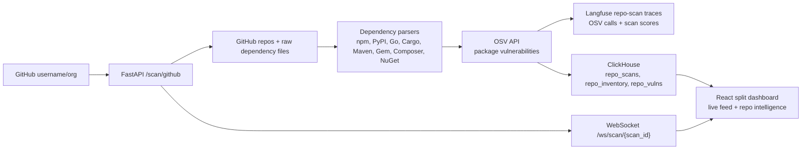

# ThreatLens


ThreatLens is a GitHub repository vulnerability intelligence platform. Give it a GitHub username or org and it scans public repos, reads dependency files, checks packages against OSV, stores findings in ClickHouse, traces scan activity in Langfuse, and shows affected repos on a live SOC dashboard with critical in-browser alarms.

> Prize targets: Best Use of ClickHouse + Best Use of Langfuse bonus.

## Architecture



The original autonomous threat agent still runs every 5 minutes and keeps the previous threat-event APIs alive. The new repo scanner is additive and is now the main demo surface.

## Setup In 3 Commands

```bash
git clone https://github.com/your-org/threatlens.git
cd threatlens && cp .env.example .env
docker compose up --build
```

Dashboard: [http://localhost:5173](http://localhost:5173)  
API: [http://localhost:8000](http://localhost:8000)

The Compose file includes ClickHouse Cloud and Langfuse defaults. Add `GROQ_API_KEY` for live LLM triage in the legacy threat agent. Repo scanning uses GitHub public APIs and OSV with no key required.

## Dashboard

The main screen is a full-height split panel:

- Left: `⬡ LIVE VULNERABILITY FEED`, an auto-scrolling CVE ticker with severity, CVSS score, package, publish date, and critical pulse animations.
- Right: repo intelligence scanner with GitHub username/org input, scan progress, sortable/filterable repo cards, expandable vulnerable dependency details, fix recommendations, severity bars, and analytics.
- In-browser alarm system: critical vulnerabilities trigger generated Web Audio beeps, a red slide-down banner, pulsing repo cards, critical counter increments, and a browser title warning.

## API

- `POST /scan/github` with `{ "username": "facebook" }`
- `GET /scan/status/{scan_id}`
- `GET /repos/{username}`
- `GET /repos/{username}/{repo_name}/vulns`
- `GET /feed/live`
- `WebSocket /ws/scan/{scan_id}`
- Existing APIs remain: `/threats`, `/analytics/summary`, `/agent/runs`, `/agent/trigger`, `/cves`, `/ws/feed`

## Why ClickHouse For Threat Intel?

Repo vulnerability scanning produces analytical data: repo, package, ecosystem, severity, CVSS, publish date, scan id, stars, language, and fix version. ClickHouse stores columns together, so dashboard queries can scan only the columns needed for rollups instead of dragging large descriptions and raw metadata through memory.

That makes these questions fast:

- Which repos have the most critical vulnerabilities?
- How many findings did this scan discover by severity?
- What changed in the last 7 days?
- Which package names create the biggest blast radius?

## Demo SQL Queries

Critical repos, expected sub-100ms on the demo dataset:

```sql
SELECT repo_name, count() AS criticals, max(cvss_score) AS worst
FROM repo_vulns
WHERE severity = 'CRITICAL'
GROUP BY repo_name
ORDER BY criticals DESC
LIMIT 5;
```

Expected:

```text
repo_name  criticals  worst
react      3          9.8
rocksdb    1          9.8
jest       1          9.8
```

Severity distribution for the dashboard:

```sql
SELECT severity, count() AS vulns
FROM repo_vulns
GROUP BY severity
ORDER BY vulns DESC;
```

Expected:

```text
severity  vulns
HIGH      10
MEDIUM    8
CRITICAL  5
```

Most affected packages:

```sql
SELECT package_name, count() AS affected_repos, max(cvss_score) AS worst
FROM repo_vulns
GROUP BY package_name
ORDER BY affected_repos DESC, worst DESC
LIMIT 10;
```

Expected:

```text
package_name           affected_repos  worst
lodash                 4               9.8
minimist               3               9.8
serialize-javascript   3               8.1
```


## Development

Backend:

```bash
cd backend
python -m venv .venv
source .venv/bin/activate
pip install -r requirements.txt
uvicorn app.main:app --reload
```

Frontend:

```bash
cd frontend
npm install
npm run dev
```
